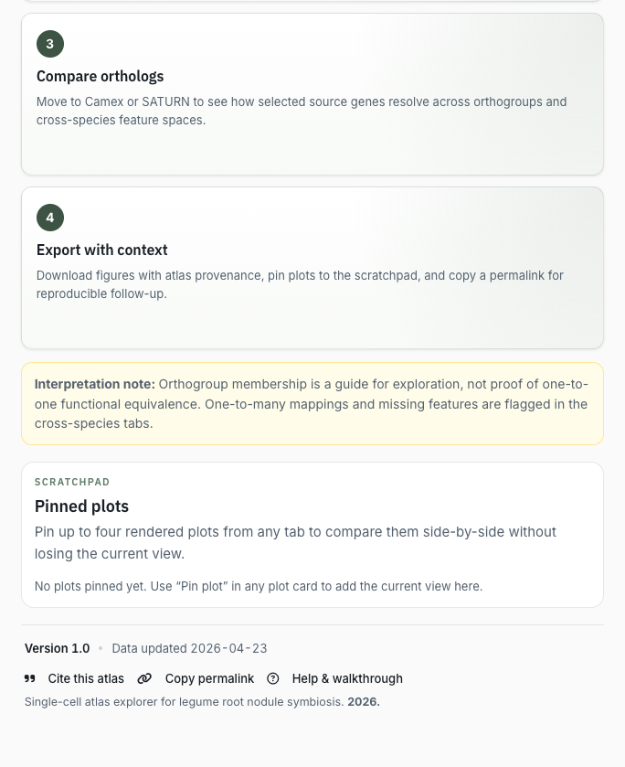

# Legume Root Nodule Symbiosis Atlas Documentation

```{raw} html
<div class="hero-card">
<strong>Explore root nodule symbiosis across species.</strong><br>
This Shiny atlas helps researchers inspect gene expression across published single-cell legume nodule datasets, compare ortholog-aware expression patterns, and export reproducible figures with atlas provenance.
</div>
```

{.doc-screenshot}

## What You Can Do

- Search genes from *Medicago truncatula*, *Glycine max*, or *Lotus japonicus*.
- View expression in within-species single-cell atlases.
- Compare mapped ortholog features in CAMEx and SATURN cross-species integrations.
- Use cluster markers to seed a gene panel.
- Inspect average expression by cluster, dot plots, UMAP expression, violin plots, and ridge plots.
- Download figures and mapping tables for records, teaching, or manuscript preparation.

## Who This Is For

This documentation is written for plant biologists, single-cell users, and computational researchers who want to explore root nodule symbiosis expression patterns without rebuilding the atlas from raw data.

The developer and release sections are for people deploying the app, refreshing data, or replacing project-level annotation/orthology tables.

```{toctree}
:maxdepth: 2
:caption: Using The App

quickstart
user-guide/overview
user-guide/gene-expression
user-guide/cross-species
user-guide/plots
user-guide/markers-annotations
user-guide/exports-citation
strengths-limitations
```

```{toctree}
:maxdepth: 2
:caption: Administration

admin/customization
admin/deployment
RELEASE_CHECKLIST
```

```{toctree}
:maxdepth: 2
:caption: Development

developer/contributing
ARCHITECTURE
```

## Citation

Cite the atlas version used for your analysis and the original datasets and computational methods that support the specific results you interpret.

> Pereira W. et al. A cross-species single-cell atlas of legume root nodule symbiosis. Legume Root Nodule Symbiosis Atlas, version 1.0.
