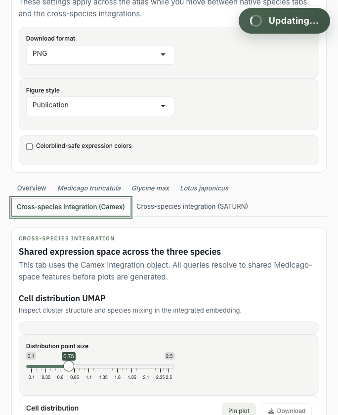

# Cross-Species Comparison

Cross-species tabs help compare expression patterns across *Medicago truncatula*, *Glycine max*, and *Lotus japonicus* in integrated feature spaces.

{.doc-screenshot}

## How Mapping Works

1. You select source genes from one species.
2. The app identifies their orthogroups.
3. Orthologous members are resolved for the selected cross-species integration.
4. Plots render the mapped features that are present in the integration object.

The mapping summary reports genes with no orthogroup, orthogroups with no target members, and mapped members missing from the integrated feature set.

## CAMEx And SATURN

- **CAMEx** uses a shared feature representation associated with Medicago-space features.
- **SATURN** uses species-prefixed features in a shared integration.

The exact plotted feature set can therefore differ between integrations.

## Interpretation Guidance

Cross-species plots are comparative tools. Similar expression in the shared embedding may suggest conserved or analogous biology, but it is not proof of one-to-one conserved cell states.

Be especially careful with:

- One-to-many orthogroups.
- Missing genes in one species or integration.
- Large paralog families.
- Genes with sparse expression.
- Clusters whose annotations are still under review.
