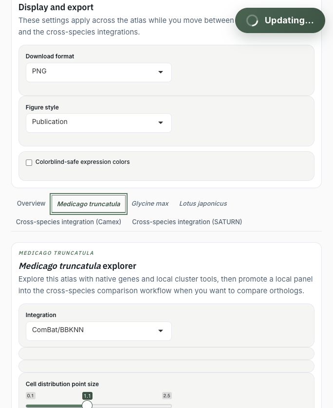

# App Overview

The atlas has three main analysis surfaces:

- **Overview**: project context, atlas summary, release/citation information, and guidance.
- **Within-species tabs**: native expression exploration for one species at a time.
- **Cross-species tabs**: ortholog-aware comparisons in CAMEx and SATURN integrations.

{.doc-screenshot}

## The Staged-Vs-Applied Workflow

Most expression panels follow the same pattern:

1. Add genes with the picker, paste/import tool, or cluster-marker buttons.
2. Review the staged gene panel.
3. Click **Generate the expression plots** or the equivalent apply button.
4. Interpret the rendered plots and downloads.

This prevents expensive plot renders from firing while you are still editing gene names.

## Species And Integrations

The current atlas covers:

- *Medicago truncatula*
- *Glycine max*
- *Lotus japonicus*
- CAMEx cross-species integration
- SATURN cross-species integration

Within-species tabs preserve native species features. Cross-species tabs map source genes to integration-specific feature spaces through orthogroups.
